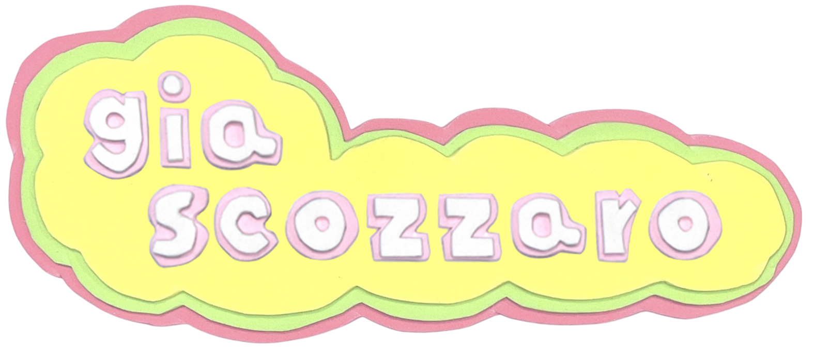
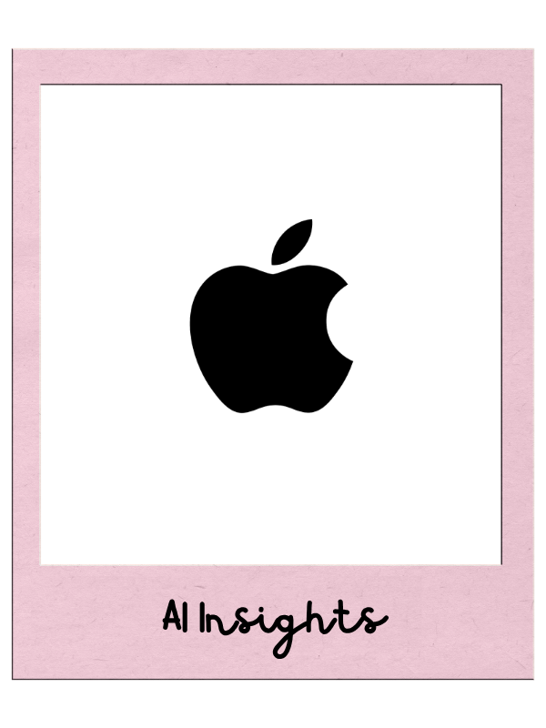
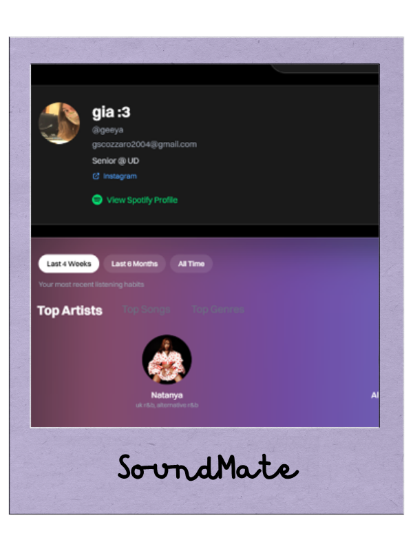
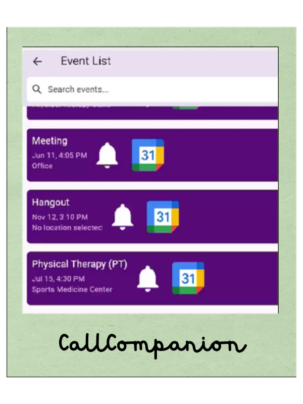
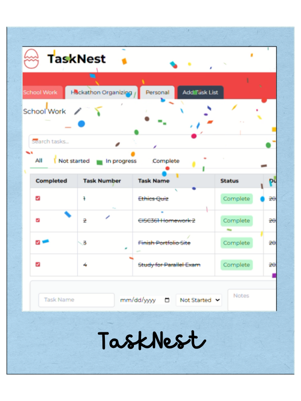

  

# 🌷software engineer
> - b.s. computer science • u.delaware 
> - building user-centered software from concept to delivery ✿

## 🙇‍♀️ currently working on

- building my first SwiftUI app
- exploring AI-powered applications
- learning system design
- **looking for new grad swe opportunities!**

## ✂️ featured projects

<table align="center">
  <tr>
    <td align="center">
      
    </td>
    <td align="center">
      
    </td>
    <td align="center">
        
    </td>
    <td align="center">
        
    </td>
  </tr>
</table>

#### 🍎 AI Insights
*(private)* built during my Apple internship to automate qualitative test analysis using LLMs, transforming hours of manual review into seconds.

#### 🎵 SoundMate
*(private)* a full-stack social platform centered around discovering people through shared music taste.

#### 📱 Call Companion
an accessibility-focused mobile application that helps users keep track of important phone conversations.

#### 🪺 TaskNest
a productivity app focused on thoughtful organization and clean user experience.

## 🖍️ favorite tools

**Languages**

`Python` `Java` `JavaScript` `TypeScript` `Swift`

**Frontend**

`React` `Next.js` `HTML` `CSS`

**Backend**

`Node.js` `REST APIs`

**Currently Learning**

`SwiftUI` `System Design` `AI Engineering`

## 🌼 around the internet

🌐 **Portfolio**  
https://giascozzaro.com

💼 **LinkedIn**  
https://linkedin.com/in/gscozzaro

📫 **Email**  
giov.scozzaro@email.com

---

> *i love designing user-centered software that's just as enjoyable to use as it is to build!*

###### last updated · summer 2026 🌿
